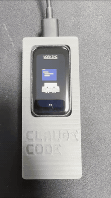

# Clawd Badge — Claude Code Notify Badge

**手のひらサイズの ESP32 バッジが、Claude Code の「今」を教えてくれる。**

Claude Code に長いタスクを任せてブラウザを見ていたら、いつの間にか承認待ちで止まっていた——そんな経験はありませんか?
Clawd Badge は Waveshare **ESP32-C6-Touch-LCD-1.47** をデスクに置ける物理ステータスバッジに変えるプロジェクトです。マスコット **Clawd** が、作業中はハサミをカチカチ、完了したらぴょんと跳ねて ✓、承認が必要なら手を振って知らせてくれます。

<p align="center">
  
</p>

▶ 高画質版の動画は [docs/media/demo.mp4](docs/media/demo.mp4) をご覧ください。

## 特徴

- 🎬 **状態がひと目でわかる** — working / done / approval / notify / error / idle をアニメーションで表示
- 📡 **USB でも WiFi でも** — USB シリアル直結、または一度 WiFi 設定すれば LAN 上のどの PC からでも HTTP で通知可能
- 🪄 **セットアップは実質ワンコマンド** — Claude Code プラグイン、または `clawd-badge setup` で hooks 登録まで自動
- 👥 **複数セッション対応** — 複数マシン・複数ターミナルの状態を最大8セッションまで集約表示(画面下部にセッションドット)
- 🖨️ **3Dプリントケース付き** — 専用ケースの STL を同梱([`hardware/`](hardware/))

## 動作の仕組み

```
Claude Code (hooks) ──► clawd-badge notify / notify_device.py ──► バッジ
     │                                                              │
     │  UserPromptSubmit → working      USB シリアル (JSON 1行)      │
     │  Stop             → done    or   HTTP POST /notify (LAN)     │
     │  Notification     → approval                                 │
     │  SessionEnd       → idle                                     │
     └──────────────────────────────────────────────────────────────┘
```

Claude Code の hooks がイベント発生時に通知クライアントを起動し、`{"state":"working","sid":"...","msg":"...","ts":...}` の JSON をバッジへ送信。ファームウェアが状態に応じた Clawd のアニメーションに切り替えます。

`Notification` hook は権限承認以外(アイドル入力待ち等)でも発火するため、stdin JSON の `notification_type` が `permission_prompt` / `elicitation_dialog` / `agent_needs_input` のときのみ `approval` を送信します(`notification_type` が無い古い Claude Code では従来どおり送信)。詳細は [`client/README.md`](client/README.md) 参照。

## 状態と表示

| state    | Clawd の様子                    |
|----------|--------------------------------|
| working  | ハサミをカチカチ、タイピング風   |
| done     | ぴょんと跳ねて ✓                |
| approval | 手を振って「?」吹き出し          |
| notify   | ベル＋首かしげ                  |
| idle     | ゆっくり呼吸＋まばたき           |
| error    | 目が「><」                      |

## 必要なもの

- [Waveshare ESP32-C6-Touch-LCD-1.47](https://www.waveshare.com/wiki/ESP32-C6-Touch-LCD-1.47)(タッチ版、LCD コントローラ JD9853)
- USB Type-C ケーブル
- (任意)3D プリンタ — 専用ケース [`hardware/clawd-badge-body.stl`](hardware/clawd-badge-body.stl)

## クイックスタート

### 1. ファームウェアの書き込み

WiFi / WebServer / mDNS を含むためパーティションは `min_spiffs` を指定します(フラッシュ使用率 74%・RAM 使用率 14% で検証済み):

```powershell
arduino-cli compile --fqbn esp32:esp32:esp32c6:CDCOnBoot=cdc,PartitionScheme=min_spiffs firmware\ClawdBadge
arduino-cli upload -p COM5 --fqbn esp32:esp32:esp32c6:CDCOnBoot=cdc,PartitionScheme=min_spiffs firmware\ClawdBadge
```

### 2. 通知経路を選ぶ

#### A. USB シリアル + Claude Code プラグイン(いちばん簡単)

バッジを USB 接続した PC で使う場合。pyserial を入れてプラグインをインストールするだけです:

```bash
pip install pyserial
```

Claude Code 内で:

```
/plugin marketplace add hexylab/ClaudeCodeNotifyBadge
/plugin install clawd-badge@clawd-badge
```

シリアルポートは自動検出(Espressif VID 0x303A)。明示したい場合は環境変数 `CLAUDE_BADGE_PORT` を設定してください。詳細は [`plugin/README.md`](plugin/README.md) 参照。

#### B. WiFi / LAN + npm クライアント(どの PC からでも)

バッジを一度 WiFi につなげば、USB 接続なしで LAN 上の任意の PC から通知できます(Node.js 18 以上)。

現時点では npm 未公開のため、リポジトリからインストールしてください:

```bash
git clone https://github.com/hexylab/ClaudeCodeNotifyBadge.git
npm i -g ./ClaudeCodeNotifyBadge/client
```

セットアップ(バッジを USB 接続した PC で一度だけ):

```bash
clawd-badge setup
```

SSID・パスワードを対話入力すると、シリアル経由での WiFi 書き込み → IP 取得 → `~/.clawd-badge.json` への保存 → Claude Code hooks(`~/.claude/settings.json`)の自動登録まで行われます。

バッジの IP が分かっている別の PC では、シリアル接続なしでセットアップできます:

```bash
clawd-badge setup --host <バッジのIP>
```

主なコマンド:

- `clawd-badge notify <state>` — バッジへ状態を通知(通常は hooks から自動実行)
- `clawd-badge status` — バッジの現在状態を確認
- `clawd-badge unhook` — 登録した hooks を削除

送信先の解決順は 環境変数 `CLAUDE_BADGE_HOST` > `~/.clawd-badge.json` > mDNS 名 `clawd-badge.local` です。詳細は [`client/README.md`](client/README.md) を参照してください。

### 3. 動作確認

```powershell
python bridge\notify_device.py done "テスト"
```

または LAN 経由なら:

```bash
clawd-badge notify done
```

## リポジトリ構成

```
firmware/ClawdBadge/     ESP32-C6 用 Arduino ファームウェア (JD9853 172x320)
plugin/                  Claude Code プラグイン (hooks + 通知スクリプト、USB シリアル版)
client/                  npm クライアント clawd-badge (hooks + CLI、LAN/HTTP 版)
hardware/                3D プリント用ケース STL
docs/media/              デモ動画・GIF
bridge/notify_device.py  旧・手動設定用スクリプト(プラグイン版は plugin/scripts/ 参照)
tools/gen_sprites.py     Clawd スプライト(clawd_sprites.h)を参照 GIF から再生成するツール
```

## 複数セッション対応

`sid`(セッション識別子、任意の文字列)を含めることで、複数の Claude Code セッション(複数マシン/複数ターミナル)の状態を個別に管理できます。

- `sid` を省略した場合は固定 `sid` `"_nosid"` として扱われ、旧クライアントは単一セッションとして動きます。
- 画面(キャラ・ヘッダー)には全セッションを優先度 `error > approval > notify > working > done` で集約した状態を表示します。セッションが1つも無ければ `idle` です。
- `state:"idle"`(`SessionEnd` 相当)を受信すると、そのセッションはテーブルから削除されます。
- 画面下部にはセッション数ぶんのドットが状態色で表示され(`approval` は約500ms周期で点滅)、右側にセッション数が数字で表示されます。
- セッションテーブルは最大8件。満杯の場合は最終更新が最も古いセッションを上書きします。
- タイムアウトはセッションごとに判定されます: `working` は30分、それ以外(`done`/`approval`/`notify`/`error`)は5分で自動削除されます。

## WiFi / LAN 通知(ファームウェア側インターフェース)

`firmware/ClawdBadge/ClawdBadge.ino` は WiFi 接続と HTTP サーバに対応しています。

- WiFi 認証情報は NVS(Preferences namespace `clawd`)に永続化され、起動時に自動接続。切断時は 15 秒間隔で再接続します。
- USB シリアル(115200bps、1行 JSON)経由のコマンド:
  - `{"cmd":"wifi","ssid":"...","pass":"..."}` — WiFi 認証情報を保存して接続。`{"event":"wifi","status":"connected","ip":"...","hostname":"clawd-badge.local"}` などが返されます(失敗時は `"status":"failed"`)。
  - `{"cmd":"wifi_status"}` — 現在の WiFi 接続状態を問い合わせ
  - `{"cmd":"wifi_clear"}` — 保存済みの WiFi 認証情報を消去
- HTTP サーバ(ポート 80): `POST /notify`(ボディ例 `{"state":"working","sid":"a1b2c3d4","msg":"..."}`)、`GET /status`
  - `GET /status` のレスポンスにはセッション数 `"sessions"`、承認待ち件数 `"waiting"`、各セッションの `"sid"`/`"state"` を格納した `"list"` 配列が含まれます。
- mDNS 名 `clawd-badge.local` で名前解決できます。
- USB シリアル通知(プラグイン版)は WiFi 未設定でもそのまま動作します。

## ハードウェア仕様(実機確認済み)

- LCD: JD9853 コントローラ 172×320(Arduino_GFX の ST7789 クラス＋公式デモの JD9853 初期化シーケンスを使用)
- SPI: MOSI=GPIO2, SCLK=GPIO1, CS=GPIO14, DC=GPIO15, RST=GPIO22, BL=GPIO23(アクティブHigh)
- タッチ: AXS5106L (I2C SDA=GPIO18, SCL=GPIO19) ※現状未使用
- RGB LED: 非搭載(ファームウェア内では `ENABLE_RGB_LED 0` で無効化)

## 3D プリントケース

[`hardware/clawd-badge-body.stl`](hardware/clawd-badge-body.stl) に本プロジェクト用に設計したケース(本体)の STL を同梱しています。デモ動画のバッジはこのケースに収めたものです。

## ライセンス

[MIT License](LICENSE)
